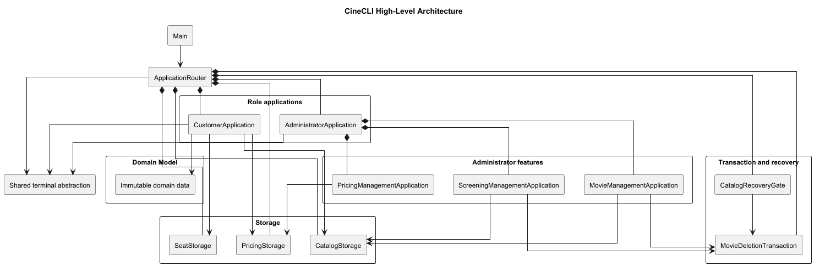
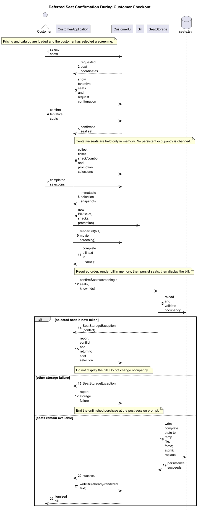
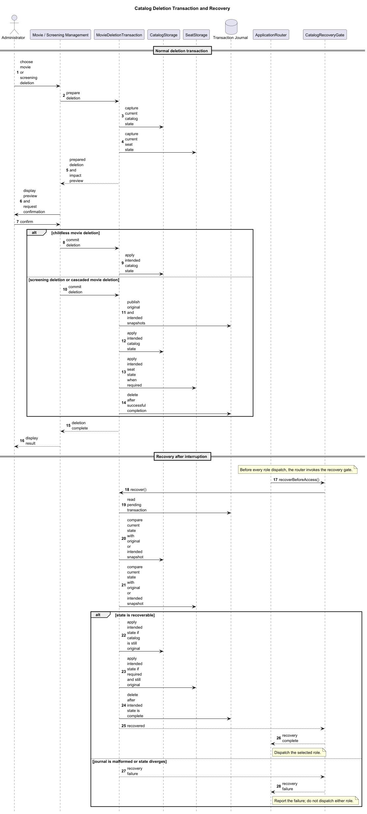

# Developer Guide

## Table of contents

1. [Project status](#project-status)
2. [Toolchain and standards](#toolchain-and-standards)
3. [Build and verification](#build-and-verification)
4. [Architecture](#architecture)
5. [Source responsibilities](#source-responsibilities)
6. [Customer purchase workflow](#customer-purchase-workflow)
7. [Role routing and administrator workflows](#role-routing-and-administrator-workflows)
8. [Persistence](#persistence)
9. [Transaction and recovery design](#transaction-and-recovery-design)
10. [Testing](#testing)
11. [Design considerations](#design-considerations)
12. [Future work and out of scope](#future-work-and-out-of-scope)

## Project status

CineCLI implements customer and administrator command-line roles. Customers can
choose a screening, select tentative seats, select ticket types, optionally add
snacks and a promotion, and finalize occupied seats before the bill is printed.
Administrators manage movies, screenings, global ticket and snack/combo prices,
and percentage promotions.

The catalog, pricing, and temporary confirmed-seat occupancy are UTF-8,
versioned plain-text files. Ticket selections, snack selections, applied
promotions, and bills are immutable in-memory snapshots for one customer
session.

## Toolchain and standards

- Java 25 LTS, without preview features
- Maven 3.9.16 through the Maven Wrapper
- JUnit Jupiter 5.14.4
- Java package root `cinecli`

All selected build-plugin and dependency versions are pinned in `pom.xml`.

The repository is governed by `AGENTS.md` and these external standards:

1. `../Resources/CS2113 - Software Engineering for Self-Directed Learners [Printable Version for CS2113].pdf`
2. `../Resources/Java coding standard.pdf`

The project follows the Java standard's written indentation rule: four spaces
for a block and an additional eight spaces for a continuation; tabs are not
used in Java source.

## Build and verification

On Windows:

```powershell
java --version
.\mvnw.cmd --version
.\mvnw.cmd clean verify
java -jar target\cinecli-0.1.0-SNAPSHOT.jar
```

On macOS or Linux:

```shell
java --version
sh ./mvnw --version
sh ./mvnw clean verify
java -jar target/cinecli-0.1.0-SNAPSHOT.jar
```

`clean verify` produces the JaCoCo report and enforces 100% aggregate line and
branch coverage. `target/cinecli-0.1.0-SNAPSHOT.jar` is the Maven
development/build artifact and starts at `cinecli.app.Main`. The user-facing
distribution is `release/cinecli.jar`, produced by copying the successfully
verified Maven artifact; it does not require a Maven version change or another
packaging mechanism.

## Architecture

`Main` creates a UTF-8 terminal and passes the runtime paths to
`ApplicationRouter`. The router is the composition root and role loop. It
constructs the shared catalog, pricing, seat, and deletion-recovery
dependencies once; before it dispatches either role, it runs the recovery gate.

The customer and administrator applications coordinate their own workflows.
They depend on UI/terminal seams for interaction, immutable model types for
business data, and storage modules for complete validated state. Storage owns
file formats and atomic replacement; the UI does not implement persistence or
monetary calculations.

<!-- Diagram placeholder: high-level architecture/class diagram.
     Show Main -> ApplicationRouter; router links to CustomerApplication and
     AdministratorApplication; both link to UI/terminal, model, and storage;
     show CatalogRecoveryGate and MovieDeletionTransaction beside catalog/seat
     storage. -->



## Source responsibilities

Source is under `src/main/java/cinecli/`; tests are under
`src/test/java/cinecli/`. The bundled default catalog is
`src/main/resources/cinecli/default-catalog.tsv`, and mutable runtime files are
under `data/runtime/` relative to the process working directory.

### Application coordination

- `Main` bootstraps UTF-8 streams and runtime paths without workflow logic.
- `ApplicationRouter` owns role transitions, shared dependency wiring, and the
  recovery check before a customer or administrator workflow runs.
- `CustomerApplication` coordinates one customer session, including the final
  render-then-confirm ordering.
- `AdministratorApplication` owns the administrator home menu and delegates to
  movie, screening, or pricing management.
- `CustomerWorkflowOutcome` and `AdminWorkflowOutcome` carry typed routing
  outcomes instead of using exceptions for normal role changes.

### UI and terminal

- `Utf8Terminal` is the shared terminal adapter. It converts trimmed,
  case-insensitive `/admin`, `/customer`, and `/exit` input into typed terminal
  results.
- `CustomerUi` owns customer prompts, the 7-by-20 seat-map display, menus, and
  the formatted four-section bill.
- `AdminTerminal`, `AdminWorkflowInteraction`, `AdminWorkflowInput`, and the
  types in `cinecli.admin.ui` keep administrator interaction and terminal
  failure handling separate from administration rules.

### Administrator features

- `MovieManagementApplication` and its input/text/terminal helpers list, add,
  edit, preview, and delete movies. Generated movie IDs use `MOV-<UUID>`.
- `ScreeningManagementApplication` and its helpers manage screenings in
  movie-major persisted order. Generated IDs use `SCR-<UUID>`; a screening's
  ID and parent movie do not change when it is rescheduled.
- `PricingManagementApplication` delegates to focused ticket-price,
  snack/combo-price, and promotion workflows. Their input rules parse cents and
  whole percentages exactly, and each confirmed mutation saves one replacement
  `Pricing` state.
- `UuidGenerator`, `AdminInputRules`, and the result/interaction types support
  shared administration behaviour. Add, edit, and delete workflows stage a
  change, display a preview, and require confirmation before persistence.

### Domain

- `Movie`, `Screening`, `ContentRating`, `SeatCoordinate`, and
  `ScreeningSelection` describe the catalog and its customer-facing selection.
- `TicketType` and `SnackMenuItem` are fixed menu identities. `Pricing` supplies
  their current global prices and the available `PromoCode` values.
- `TicketSelection`, `SnackSelection`, and `PromoCode` capture the values used
  for a session. `Bill` defensively owns those selections and performs the
  integer-cent subtotal, percentage-discount, and rounding calculations.

### Persistence

- `CatalogStorage` and `CatalogParser` initialize a missing catalog from the
  bundled resource, then validate and read or atomically save the complete
  catalog.
- `PricingStorage` and `PricingParser` seed, validate, load, and atomically
  replace complete pricing state.
- `SeatStorage`, `SeatParser`, and `SeatOccupancySnapshot` read missing
  occupancy as empty and atomically confirm a complete updated occupancy state.
- `CatalogTransactionAdapter`, `SeatTransactionAdapter`,
  `MovieDeletionTransaction`, `CatalogRecoveryGate`, and their transaction
  value types implement multi-file deletion recovery.
- `cinecli.storage.exception` contains the checked storage-failure hierarchy;
  operation hooks support deterministic storage and transaction failure tests.

## Customer purchase workflow

The customer role begins after the welcome prompt. It loads pricing before the
catalog or seat occupancy, so a pricing seed, read, or validation failure ends
the session without accessing seat state. A catalog failure similarly ends the
session.

Screenings are labelled `A`, `B`, and so on within each persisted movie. Thus,
`3B` selects the second screening of the third movie; lowercase input is
accepted. The terminal seat map shows `SCREEN` above row `G`, rows `G` through
`A`, and seat numbers `1` through `20`. Persisted taken seats and the current
session's tentative seats both display as `X`.

Tentative seats exist only in the customer workflow. Confirming the seat choice
with `Y` does not write `seats.tsv`; declining it, cancellation, a global role
command, EOF, or terminal failure discards that in-memory state. The customer
then selects a ticket type for each sorted seat, optionally selects quantities
of snack/combo items, and may enter one promotion. Re-selecting a snack/combo
replaces its earlier quantity while preserving original item order. A blank
promotion input skips the promotion, and promotions are looked up
case-insensitively.

`TicketSelection`, `SnackSelection`, and `PromoCode` capture the prices or
percentage from the loaded pricing state. `Bill` therefore remains unaffected
by a later administrative pricing change. It calculates all monetary values in
integer cents; the final payable amount rounds half cents up.

Finalization has a deliberate order:

1. Complete the ticket, snack/combo, and promotion selections and construct the
   immutable bill.
2. Render the complete bill string in memory.
3. Reload validated seat occupancy and atomically confirm the selected seats.
4. Write the already-rendered bill only after confirmation succeeds.

If a final confirmation detects a newly occupied seat, no bill is printed and
the customer returns to seat selection with freshly loaded occupancy. A
non-conflict seat-storage failure is reported and ends the unfinished purchase
at the post-session prompt. Once confirmation succeeds, a later bill-output
failure does not roll back seats.

<!-- Diagram placeholder: customer purchase sequence diagram.
     Show Customer -> CustomerApplication -> CustomerUi, PricingStorage,
     CatalogStorage, SeatStorage; include tentative selection, bill rendering,
     seat confirmation, conflict retry, and bill output after confirmation. -->



## Role routing and administrator workflows

The router starts in customer mode. `/admin`, `/customer`, and `/exit` are
recognized at every shared-terminal prompt. A global command only abandons the
current session's in-memory customer state; it does not persist or release
tentative seats. Local `/cancel` and Back choices remain within their active
workflow's normal outcome handling.

The administrator home exposes Movie Management, Screening Management, and
Pricing and Promotions Management, plus the option to return to customer mode.
Administration workflows display loaded state, validate guided input, stage the
proposed replacement, show a preview, and save only after `Y`. `N`, `/cancel`,
EOF, and input failure before confirmation abandon the staged change. A failed
storage save is reported without committing that replacement.

Movie deletion removes the movie, its child screenings, and occupancy for those
screenings. Screening deletion removes only that screening and its occupancy.
A reschedule changes only date and/or time, retaining its ID, parent, position,
and occupancy. A missing occupancy file stays missing through a deletion; if an
existing occupancy file has no affected seat record, deletion preserves its
bytes. An occupancy parsing or read error only blocks an operation that needs
that occupancy snapshot.

Ticket and snack/combo identities remain fixed, but their prices are editable
from `0.01` through `9999.99` inclusive. Promotions have a normalized uppercase
code, are unique case-insensitively, and have a whole-number percentage from 1
through 100 inclusive. Pricing saves are complete-state replacements rather than
independent per-item writes.

## Persistence

The detailed data policy is in `data/README.md`. All files are UTF-8,
tab-separated, and versioned. Their parsers validate the complete file before
returning state, so the UI never receives a partially parsed result.

### Catalog

`data/runtime/catalog.tsv` uses this version-1 format:

```text
CINECLI-CATALOG<TAB>1
MOVIE<TAB>movieId<TAB>title<TAB>rating
SCREENING<TAB>screeningId<TAB>movieId<TAB>yyyy-MM-dd<TAB>HH:mm
```

The header is required; a header-only catalog is valid. Movie and screening IDs
are unique within their record type and match `[A-Za-z0-9][A-Za-z0-9_-]*`.
Titles are nonblank without surrounding whitespace, ratings are `PG13`, `M18`,
or `R21`, date/time fields are strict, and each screening references an existing
movie. Persisted order determines display order. A missing catalog is copied
from the bundled default; a malformed existing catalog is preserved and fails
to load.

### Pricing

`data/runtime/pricing.tsv` uses this version-1 format:

```text
CINECLI-PRICING<TAB>1
TICKET_PRICE<TAB>ticketIdentity<TAB>price
SNACK_PRICE<TAB>snackIdentity<TAB>price
PROMOTION<TAB>code<TAB>percentage
```

Every fixed ticket identity (`ADULT`, `SENIOR`, `STUDENT`) and fixed snack/combo
identity (`POPCORN`, `NACHOS`, `SOFT_DRINK`, `POPCORN_COMBO`,
`NACHOS_COMBO`) occurs exactly once. Prices use two decimal places in the range
`0.01` to `9999.99`; promotion codes are uppercase, 1-to-32-character
identifiers with an alphanumeric first character; promotion percentages are
whole numbers from 1 to 100. Missing pricing is atomically seeded with the
default fixed prices plus `CS2103` at 20% and `CS3227` at 99%. Valid existing
data is not rewritten during load; malformed data is preserved and rejected.

### Temporary seat occupancy

`data/runtime/seats.tsv` uses this version-1 format:

```text
CINECLI-SEATS<TAB>1
TAKEN_SEAT<TAB>screeningId<TAB>seatCoordinate
```

A header-only file means no seats are taken. Coordinates are canonical `A1`
through `G20`, and every record must refer to a current catalog screening. A
missing file reads as empty and remains absent while the customer is browsing.
Only successful final confirmation creates or replaces it. Records are written
deterministically by screening ID, row, and seat number.

### Atomic single-file updates

Catalog, pricing, and seat updates serialize and validate the complete intended
state, write and force a temporary file in the target directory, then require
an atomic replacement. They do not fall back to a non-atomic move. A failed
write or unsupported atomic replacement reports a checked storage exception;
the target remains unchanged (and a previously missing seat target remains
missing).

## Transaction and recovery design

Screening deletion and movie deletion with child screenings use the durable
`data/runtime/catalog-transaction.journal`. `MovieDeletionTransaction` prepares
and validates original and intended catalog/seat snapshots before confirmation.
It atomically publishes a journal containing the operation (`DELETE_MOVIE` or
`DELETE_SCREENING`), subject ID, and checksummed, encoded original and intended
snapshots. It then replaces the intended catalog and, when changed, intended
occupancy; it verifies both snapshots before deleting the journal.

`CatalogRecoveryGate` calls recovery before the router dispatches either role.
Recovery validates a journal's schema and its semantic relationship to the
deletion, compares current files with the journal's original or intended
snapshots, and completes missing intended writes idempotently. It removes the
journal only after both intended snapshots verify. A malformed, unreadable, or
divergent journal blocks affected access rather than guessing or overwriting
current data.

Only movie deletion with no child screenings takes the catalog-only path and
does not need the multi-file journal.

<!-- Diagram placeholder: deletion and recovery sequence diagram.
     Show administrator confirmation -> prepare snapshots -> publish journal ->
     catalog replacement -> optional seat replacement -> verification -> journal
     deletion; show restart path through CatalogRecoveryGate and divergence
     failure. -->



## Testing

Tests use injected readers, writers, operation hooks, and temporary directories;
they do not read or write the real `data/runtime` directory.

### Unit tests

Model, parser, input-rule, terminal, UI-formatting, and selection tests cover
validation, boundary values, immutable snapshots, money arithmetic, parsing,
and observable prompt/output formatting.

### Workflow tests

Customer and administrator workflow tests exercise valid paths, invalid-input
retries, cancellation, confirmations, typed role outcomes, terminal failures,
and the customer tentative-seat lifecycle. They also cover management previews,
generated-ID collision retries, rescheduling, fixed-price edits, and promotion
CRUD behaviour.

### Persistence tests

Catalog, pricing, and seat storage tests validate strict complete-file parsing,
missing-file behavior, deterministic serialization, atomic-update failures, and
preservation of existing target bytes when an update fails. Transaction tests
cover journal creation, interrupted deletion, idempotent recovery, malformed or
divergent journals, and movie/screening deletion effects on occupancy.

### Integration tests

Application-router tests cover customer/admin routing, mixed-case global
commands, administrator-home delegation, recovery before role access, and the
interaction between customer finalization and storage conflict/failure paths.

### Regression and coverage

Regression tests prove that complete later pricing replacements do not alter
captured ticket, snack, promotion, or bill values. JaCoCo is bound to Maven's
`verify` phase and checks bundle-level line and branch covered ratios of `1.00`.
Review the generated HTML report as well as the assertions; full coverage is
execution evidence, not a substitute for requirements and failure-path review.

### Packaged-JAR verification

After `clean verify`, inspect the JAR for its bundled default catalog and run
the JAR from an empty temporary working directory. This verifies both the
manifest entry point and runtime catalog initialization independently of the
repository's own `data/runtime` directory.

## Design considerations

- **Role routing is explicit.** The router owns global role changes and uses
  typed outcomes, keeping normal control flow out of exception handling.
- **Tentative and confirmed seats are distinct.** Tentative selections are
  session-only; only the final confirmation changes durable occupancy. This
  lets cancellation and role switching discard unfinished work without a
  compensating seat-release write.
- **Pricing is configuration, not purchase history.** Fixed item identities are
  stable while `Pricing` provides mutable global values. Session selections
  capture their values so a later configuration update cannot rewrite an
  already-calculated bill.
- **Complete-state atomic writes protect individual runtime files.** Parsers and
  serializers operate on full state, and persistence requires same-directory
  atomic replacement.
- **Deletion recovery has a separate boundary.** Screening deletion and cascaded
  movie deletion use a journal with a presence-aware occupancy snapshot; a
  recovery gate prevents either role from reading affected data in an
  indeterminate state.
- **Storage failures are recoverable at workflow boundaries.** Checked storage
  exceptions allow customer and administrator coordinators to report failure
  without treating malformed data or an incomplete update as valid state.

## Future work and out of scope

- **Booking persistence:** Ticket assignments, snack selections, promotion use,
  bills, and payment records are not persisted. A booking design should become
  the source of truth for seat allocations rather than extending the temporary
  seat file implicitly.
- **Payment:** No payment processing is implemented.
- **Cross-process locking:** The current storage protocol assumes a single
  CineCLI process. It detects a seat conflict during final reload/confirmation,
  but does not provide inter-process locking or reservations.
